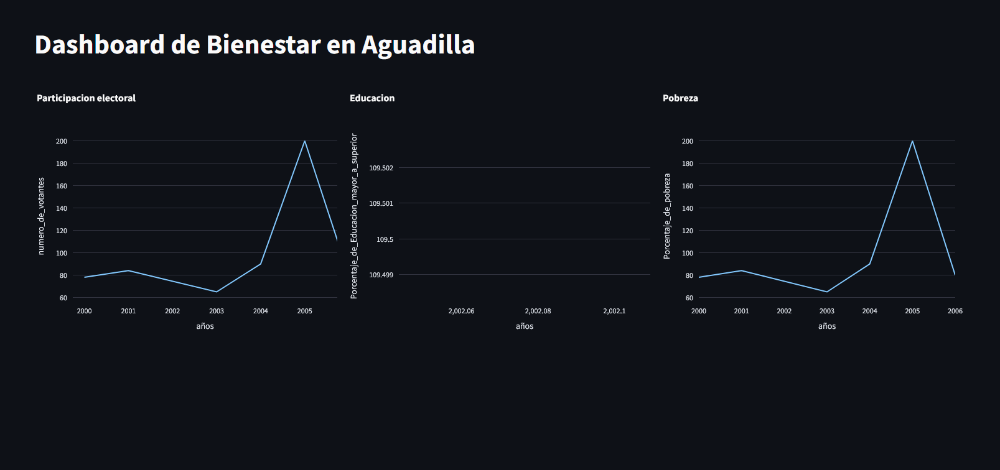

# Introduccion
- ...

## Instalacion y dependencias
- ...

```bash
git clone https://github.com/JorgeRivera94/ECON3026_Dashboard_para_la_Medicion_del_Bienestar_en_Aguadilla.git
cd ECON3026_Dashboard_para_la_Medicion_del_Bienestar_en_Aguadilla
```
### Python enviorment
```bash
python -m venv venv
source venv/bin/activate  # Linux/Mac
venv\Scripts\activate     # Windows
```
### Instalacion de Dependencias
```bash
pip install -r requirements.txt
```

## Como ejecutar el proyecto

1. Iniciar el servidor Flask:
```
python app.py
```

- Por defecto se ejecutará en:
```
http://127.0.0.1:5000
```


2. Iniciar la aplicación Streamlit:
```
streamlit run dashboard.py
```

- Por defecto se abrirá en tu navegador:
```
http://localhost:8501
```


3. Demo del frontend


### Team project by:
@JorgeRivera94 Jorge Rivera (jorge.rivera94@upr.edu)\
@j4ckrisz Bryan Lopez (bryan.lopez20@upr.edu)\
@luisitopr7394 Luis Ceballos (luis.ceballos@upr.edu)\
